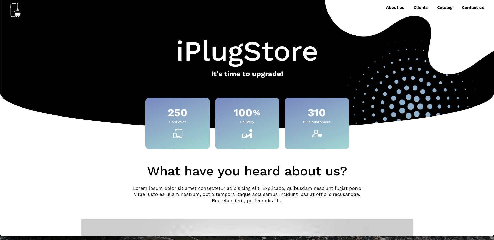

# iPlugStore

iPlugSore is a project built using Vue. It's a platform to purchase pre-owned iPhones.




### Built With:

- **VueJS:** Core logic and interactions.
- **SCSS:** Styling


## Getting Started

Follow these steps to set up and run the project locally:

1. **Clone the repository:**

   ```sh
   git clone https://github.com/Paris2020/iplugstore.git

   ```

2. `cd iplugstore`

3. `npm install`

4. Run the project locally
   `npm start`


## Contributing

Pull requests are welcome. For major changes, please open an issue first
to discuss what you would like to change.


<!--# Vue 3 + Vite

This template should help get you started developing with Vue 3 in Vite. The template uses Vue 3 `<script setup>` SFCs, check out the [script setup docs](https://v3.vuejs.org/api/sfc-script-setup.html#sfc-script-setup) to learn more.

## Recommended IDE Setup

- [VS Code](https://code.visualstudio.com/) + [Volar](https://marketplace.visualstudio.com/items?itemName=Vue.volar) (and disable Vetur) + [TypeScript Vue Plugin (Volar)](https://marketplace.visualstudio.com/items?itemName=Vue.vscode-typescript-vue-plugin). -->
